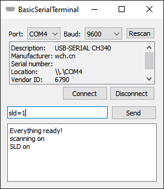

 #  BasicSerialTerminal

BasicSerialTerminal is a simple serial terminal application written with Qt and C++.

  

## License
BasicSerialTerminal is free software and licensed under GPLv3. See [LICENSE](LICENSE).
